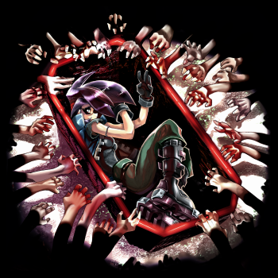

  
   
  <a href="https://www.studiotrophis.com/site/projects/thewhitechamber">Website</a> | <a href="https://lockeddoorpuzzle.itch.io/the-white-chamber">itch.io</a>

## About

This repository contains the original source code and asset files for the video game _the white chamber_. The sources are in the [Original](Original/) directory.

These files were obtained from the official [Studio Trophis](https://www.studiotrophis.com/) website (alternatively, from [here](https://lockeddoorpuzzle.itch.io/the-white-chamber)).

Richard Perrin, the designer, has also made the game freely available on itch.io along with its soundtrack, source code, and audio drama.

  

## Credits
For a complete list of credits, see the [CREDITS](CREDITS.md) document.

## License
_the white chamber_'s source code and assets are licensed under the [Creative Commons Attribution-Non-Commercial-Share Alike 2.0 UK: England & Wales License](https://creativecommons.org/licenses/by-nc-sa/2.0/uk/).
